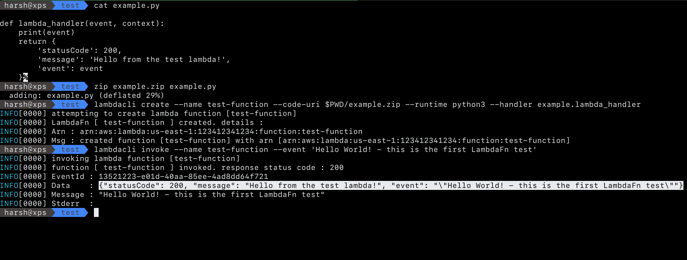
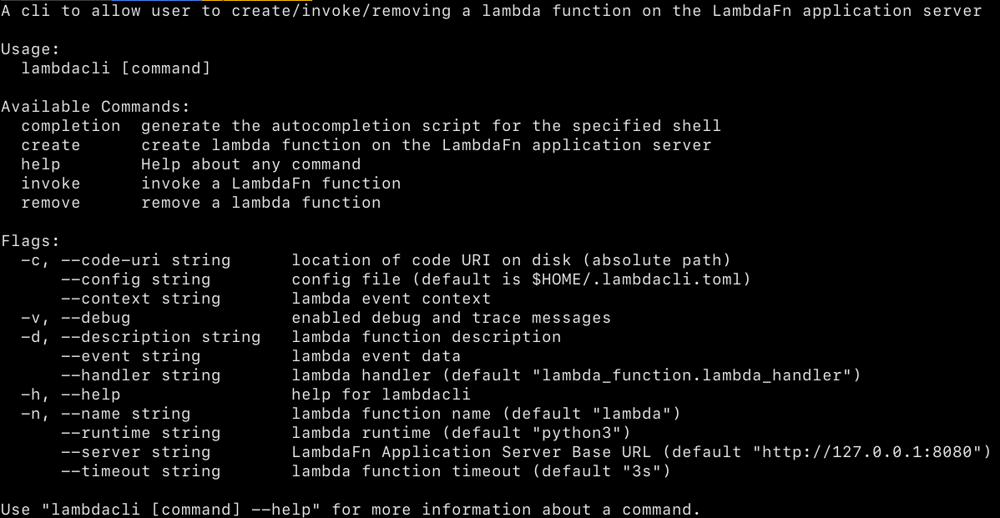

# lambdacli
a simple cli to allow interaction with [LambdaFn Application Server](https://github.com/HarshVaragiya/LambdaFn)



## Installation
```bash
go get -v github.com/HarshVaragiya/lambdacli
```
## Usage
